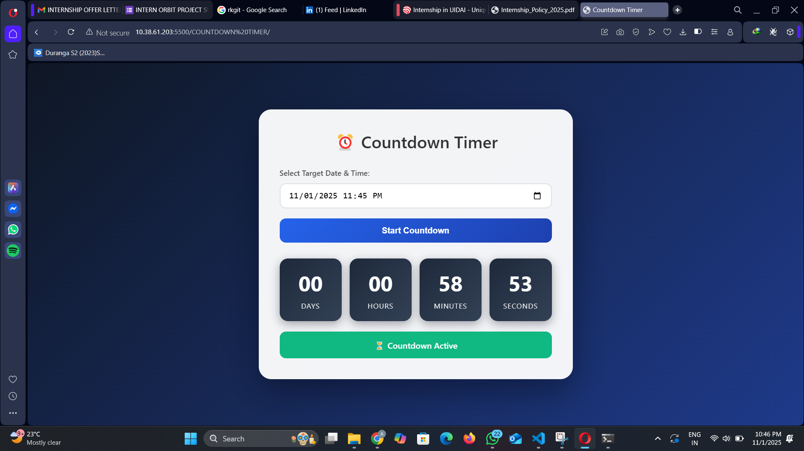

# ⏳ Countdown Timer

A **simple, responsive countdown timer web page**.  
Pick a future date and time, and the timer will count down to that moment.

---

## 🖼️ Demo

Here’s a preview of the countdown timer in action:

## 📁 Files

- **`index.html`** — main HTML file (links to CSS and JS files)  
- **`styles.css`** — contains all styles (extracted from the single-file version)  
- **`script.js`** — JavaScript logic for timer, display, and input handling  

---

## 🚀 How to Run

1. Open `index.html` in your browser (double-click or use “Open File” in the browser).  
2. Select a **future date and time** (the input enforces at least 1 minute ahead).  
3. Click **Start Countdown** to begin.

---

## 💻 Run via Local Server

If you prefer to serve it from a simple local server (instead of opening the file directly), you can use **Python**:
